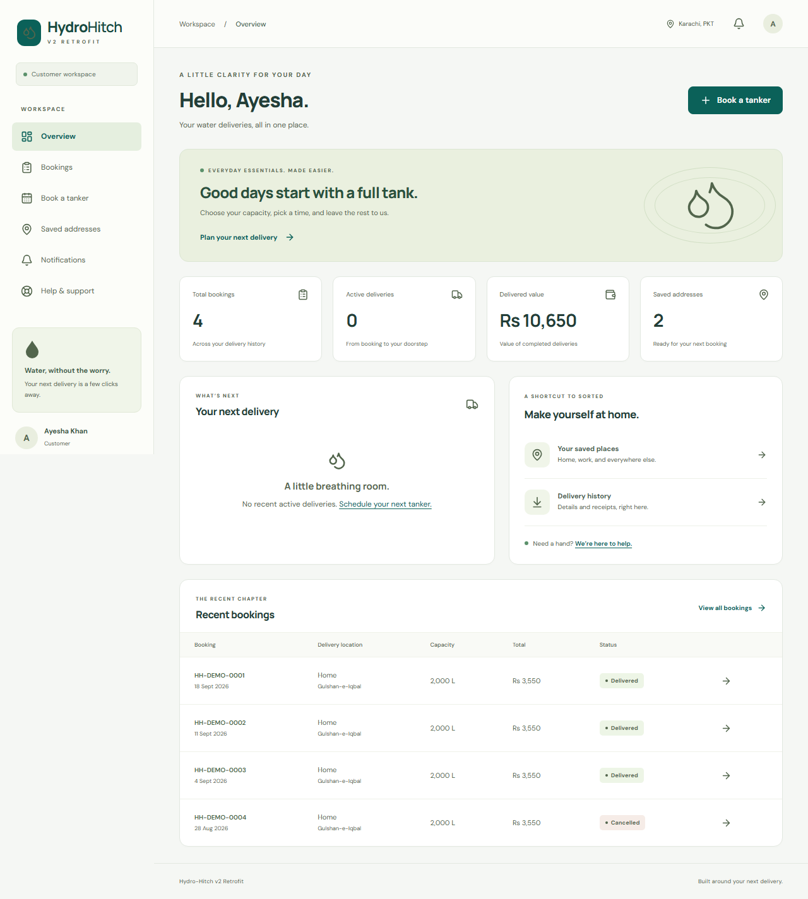
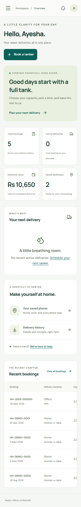
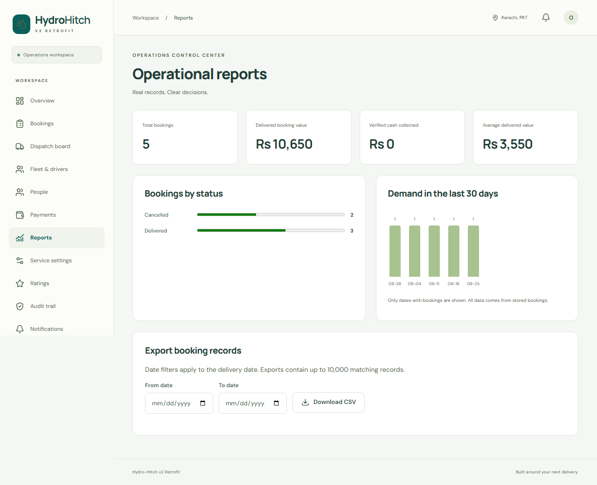
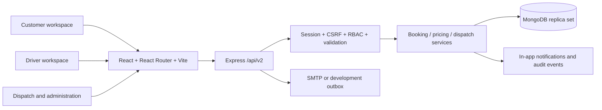
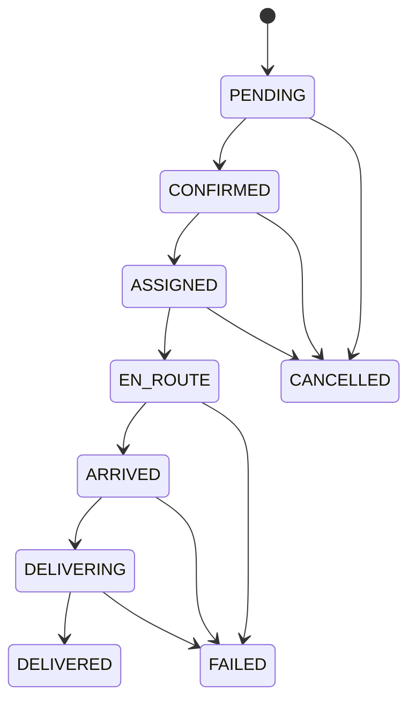

<div align="center">


# Hydro-Hitch

### Water delivery. Coordinated from booking to doorstep.

A modern MERN application for customers, drivers, dispatchers and administrators.


[](https://github.com/rehmatwadii/Hydro-Hitch/actions/workflows/ci.yml)

[Quick start](#quick-start) · [Screenshots](#screenshots) · [Architecture](#architecture-and-stack) · [Deployment](docs/DEPLOYMENT.md)

</div>

---

A retrofit of [Hydro-Hitch](https://github.com/rehmatwadii/Hydro-Hitch), preserving React, Node.js, Express and MongoDB while replacing unsafe v1 request paths and duplicated interfaces. Customers book water tankers; dispatchers coordinate resources; drivers record delivery milestones; administrators manage the service.

## Built for the whole delivery team

| Workspace     | Capabilities                                                               |
| ------------- | -------------------------------------------------------------------------- |
| Customer      | Save addresses, review prices, book a tanker and follow delivery progress. |
| Driver        | View assigned jobs, open navigation and record delivery milestones.        |
| Dispatcher    | Coordinate bookings, drivers and tankers with schedule conflict checks.    |
| Administrator | Manage people, fleet, pricing, cash records, support and reports.          |

## Features

- Customer registration, login, logout, password recovery, profile and multiple delivery addresses.
- Four-stage booking, water/capacity selection, Karachi delivery windows, instructions, promo codes, price review, immutable price snapshots and idempotent confirmation.
- Booking history, eligible cancellation, reordering, printable receipts, delivery timelines, recipient confirmation, ratings and feedback.
- Driver-scoped delivery queue, navigation links and problem reporting. No simulated GPS.
- Dispatch assignment/reassignment with capacity, availability and schedule constraints enforced in MongoDB transactions.
- Account roles/suspension, fleet records, service areas, pricing, plain-text quality information, support questions/complaints, payment ledger and audit trail.
- Scoped analytics, server-side pagination/filtering/sorting, CSV export and actual in-app notifications.
- Cash-on-delivery recording and full cash refunds require explicit administrator verification. Digital and bank-transfer providers are disabled.

This is a tested local release candidate, not a certification of production readiness. Read the deployment and remaining-limitations sections before putting it in service.

## Screenshots

Screenshots are generated from the seeded development application, not fabricated UI data.



<details><summary>Mobile and operations views</summary>




</details>

## Requirements

- Node.js 24 and npm 11 or newer.
- MongoDB replica set (MongoDB 8.2.6 is used by tests). A standalone MongoDB server cannot execute booking transactions.
- Internet access on the first install and first local-database/test run to download dependencies and the MongoDB binary.
- Docker Engine is optional. No database, email, payment or map-provider credentials are required for the isolated local demo.

## Quick start

```sh
git clone https://github.com/rehmatwadii/Hydro-Hitch.git
cd Hydro-Hitch
npm ci
npm run setup
npm run dev -- --local-db --seed
```

Open **http://localhost:5173**. The API uses **http://localhost:8001**. Keep the terminal open; Ctrl+C stops the application and its local database. Use `localhost` consistently for cookie/origin checks, rather than mixing it with `127.0.0.1`.

`setup` generates an ignored `.env` and a random `SEED_PASSWORD`. The seed is explicit, repeatable and prohibited in production. The local replica set persists under `.runtime/mongo-v2` on port 27019. Subsequent starts use the same command and retain data. Do not run two local-demo processes against the same directory.

| Demo account               | Role                   |
| -------------------------- | ---------------------- |
| `customer@hydrohitch.test` | Customer (Ayesha Khan) |
| `admin@hydrohitch.test`    | Super administrator    |
| `dispatch@hydrohitch.test` | Dispatcher             |
| `driver@hydrohitch.test`   | Driver (Bilal Ahmed)   |
| `driver2@hydrohitch.test`  | Driver (Usman Raza)    |

The password for these accounts is the locally generated **`SEED_PASSWORD` in `.env`**. It is not committed or printed in logs. Changing that variable after seeding does not change existing account passwords. Test-suite passwords exist only in isolated disposable test databases.

If you already have a MongoDB replica set, copy `.env.example` to `.env`, configure `MONGODB_URI` and `SEED_PASSWORD`, then run:

```sh
npm run seed
npm run dev
```

For a fresh demo without deleting data, select a new development database name in `MONGODB_URI` and explicitly seed it. Back up any data before removing a demo database. No reset command can silently drop a database.

## Commands

| Command                            | Purpose                                                                                 |
| ---------------------------------- | --------------------------------------------------------------------------------------- |
| `npm run dev`                      | API and Vite with your configured replica set                                           |
| `npm run dev -- --local-db --seed` | Persistent isolated local replica set and explicit demo seed                            |
| `npm run build`                    | Production React build with route splitting                                             |
| `npm start`                        | API; production also serves built React assets                                          |
| `npm test`                         | Real-MongoDB API, unit, concurrency and migration tests                                 |
| `npm run lint`                     | JavaScript, React hooks and JSX accessibility rules                                     |
| `npm run format:check`             | Formatting gate                                                                         |
| `npm run format`                   | Apply consistent formatting                                                             |
| `npm run perf`                     | Reproducible local API timing and query-plan report                                     |
| `npm run test:production`          | Smoke-test built assets, deep links, production cookie flags and CSP                    |
| `npm run migrate`                  | Read-only legacy migration preview                                                      |
| `npm run migrate -- --apply`       | Explicit legacy import; source collections remain intact                                |
| `npm run bootstrap-admin`          | Create the first production administrator using operator-provided environment variables |

Browser tests start their own isolated API, Vite and disposable replica set on ports 8002/5174:

```sh
npx playwright install chromium
npm run test:e2e
```

On Linux CI use `npx playwright install --with-deps chromium`. Tests do not touch the demo or a configured production database. Screenshots are written to `docs/screenshots`; failure traces to ignored `test-results`/`playwright-report`.

## Architecture and stack



One modular monolith, one React app, two npm workspaces and one lockfile. Mongoose defines indexed `v2_` collections; Zod defines strict request contracts; bcrypt hashes passwords; opaque random session tokens are stored only as SHA-256 hashes server-side and in HttpOnly cookies on the browser. JWT is unnecessary for this same-origin session design. There is no Redis, fake realtime transport, microservice layer or payment-card storage.

```text
client/src/
  api/           fetch client, CSRF handling and display formatting
  components/    shared accessible UI primitives
  context/       session state
  hooks/         abortable requests and debounced search
  layouts/       responsive role-aware workspace
  pages/         lazy-loaded customer/driver/admin features
server/src/
  config/        validated environment
  constants/     roles and lifecycle
  controllers/   request coordination and resource operations
  models/        indexed Mongoose schemas
  routes/        endpoint registration and OpenAPI contracts
  scripts/       seed, migration and administrator bootstrap
  services/      booking, pricing, auth and provider boundaries
  validators/    Zod input contracts
  utils/         errors and response envelope
server/tests/    unit and real-database integration tests
tests/e2e/      browser workflows and axe accessibility tests
scripts/        local runtime and performance tooling
docs/           audit, migration, deployment and release evidence
```

## Roles and delivery lifecycle

CUSTOMER can access their own bookings, addresses, notifications and requests. DRIVER can access assigned deliveries and their own support/notifications. DISPATCHER can coordinate bookings, drivers and tankers and respond to support. ADMIN adds people, fleet, pricing, payments, exports and audit access. SUPER_ADMIN can additionally create/manage administrators. Public registration always creates a customer. Every privileged API independently checks the current account and role.



Assignments use unique driver/tanker reservations per date and three-hour window. Drivers/tankers cannot begin another delivery while one is en route, arrived or delivering. Dispatch can start only on the scheduled Karachi date. A customer can cancel before assignment; later cancellations require operations staff. Terminal states cannot be reopened. Reordering starts a new booking at current prices and requires a new date/address confirmation. Completion records a recipient name and note; this is a staff attestation, not a cryptographic signature or photo proof.

## Configuration

See [`.env.example`](.env.example). Required startup values are validated before listening. `CLIENT_URL` must be HTTPS in production. `TRUST_PROXY` defaults to zero; set the exact trusted proxy-hop count only for your topology. `SERVE_STATIC=true` can serve built assets in a local HTTP demonstration. Production always serves assets.

No JWT secrets are needed because sessions use random opaque tokens. Password reset links last 30 minutes and are single-use; resetting revokes all sessions. With no SMTP configuration, development writes reset emails to ignored `.runtime/outbox`; production never writes reset tokens to a local outbox and the public response remains generic. Configure SMTP and verify delivery before enabling account recovery in production. In-app operational notifications remain available without external providers.

## API documentation

- Human-readable endpoint reference: **http://localhost:8001/api/docs**
- OpenAPI 3.1 document: **http://localhost:8001/api/v2/openapi.json**
- Liveness: `/health`; database readiness: `/ready`.

Responses use `{success:true,data:...}` or `{success:false,error:{code,message,details?,requestId}}`. List responses return `{items,total,page,pages}`. Protected writes require `X-CSRF-Token`, returned by login/registration/`auth/me`. Booking creation additionally requires `Idempotency-Key` and the reviewed `quoteRevision`. A pricing change requires the customer to review again. All operational money is whole PKR; booking times are interpreted in Asia/Karachi. No authenticated API data is cached.

## Migration and original data

Read [MIGRATION.md](docs/MIGRATION.md) before applying imports. New collections are separate; no migration runs automatically at startup. Completed legacy orders are imported with historical caveats, while open orders and vendor/product mappings require operator review. Legacy password hashes are not reused. The published history starts from a clean v2 snapshot; original credential-bearing commits are excluded. See [publication details](docs/PUBLICATION.md).

## Docker and production deployment

```sh
docker compose config
docker compose up --build -d
docker compose exec app node server/src/scripts/seed.js
```

The complete Compose stack is a **local demonstration** at http://localhost:8001; MongoDB binds to loopback on the host and has no authentication inside this development network. Set `SEED_PASSWORD` in the local `.env` before explicitly seeding. Do not expose this Compose database publicly.

For production, build the multi-stage Dockerfile and connect it to an authenticated MongoDB replica set, behind HTTPS. Run the image with `NODE_ENV=production`, `CLIENT_URL=https://your-domain`, `MONGODB_URI`, and correctly configured SMTP. The runtime runs as the `node` user and includes a readiness health check. Initialize the first administrator with `ADMIN_NAME`, `ADMIN_EMAIL`, `ADMIN_PHONE`, `ADMIN_PASSWORD` and `npm run bootstrap-admin` (or the direct script in the runtime image), then remove those temporary variables. Review default Karachi areas/prices before accepting bookings.

See [DEPLOYMENT.md](docs/DEPLOYMENT.md) for the full runbook, validation status and operational requirements. CI runs formatting, lint, tests, browser workflows, audit, frontend build and Docker build. No automatic deployment is configured.

## Security notes

Published branches use clean v2 history that excludes original credential-bearing commits and personal archives. Local `.env`, runtime data and demo passwords stay out of Git. Previously exposed credentials still require provider-side revocation; repository cleanup cannot invalidate a password or erase third-party copies. See [SECURITY.md](SECURITY.md) and [publication details](docs/PUBLICATION.md).

The new API applies strict CORS, same-site HttpOnly cookies, production Secure cookies, CSRF/origin checks, Helmet, payload caps, rate limits, input allowlists, ownership filtering, transaction-backed audit events and safe error responses. Operational exports are administrator-only and escape spreadsheet formula prefixes. No user-supplied HTML or file uploads are accepted.

## Limitations and roadmap

- SMTP credentials/deliverability, production hosting, TLS, backups, restore drills and alerting remain deployment responsibilities.
- GPS telemetry, SMS/push notifications and digital/bank payments are explicitly unavailable; provider boundaries do not claim those integrations exist.
- Independent vendor self-service from v1 is replaced by the centralized operator model. Original vendor/product/quality records remain in source collections for a reviewed supplier migration; they are not silently promoted to driver/admin accounts.
- Reporting includes actual volume, status mix, delivered value, verified cash collection and CSV; advanced retention, distance optimization and utilization analysis are future work.
- No PWA service worker is installed; sensitive authenticated data is not cached for offline use.
- Browser/axe checks cover critical screens and flows, not a full manual WCAG certification or cross-browser device lab. Local performance samples are not a load-capacity guarantee.
- Dependency versions are pinned. ESLint 9 is currently selected because the React accessibility plugin does not accept ESLint 10; track its compatibility upgrade despite the clean security audit.
- Original personal documents and large media archives are intentionally excluded from the published repository.

## Verification

Recorded local validation passed **26 API/unit/migration tests** and **5 browser/accessibility tests**, plus lint, formatting, production build and smoke checks. The dependency audit had zero findings at that checkpoint. These are recorded results, not a production certification or a guarantee about future dependencies.

[Verification evidence](docs/verification) · [Current CI runs](https://github.com/rehmatwadii/Hydro-Hitch/actions)

## Contributing and license

Use a feature branch. Keep role/ownership checks on the server. Add regression tests for changed business rules, run the quality gates and document schema changes. Do not add credentials, generated builds or `node_modules`.

The upstream repository has inconsistent package license metadata and no root license grant. This retrofit does not invent a new license or change ownership; confirm licensing with the repository owner before redistribution.

Read the full [retrofit report](docs/RETROFIT_REPORT.md) and [changelog](CHANGELOG.md).
