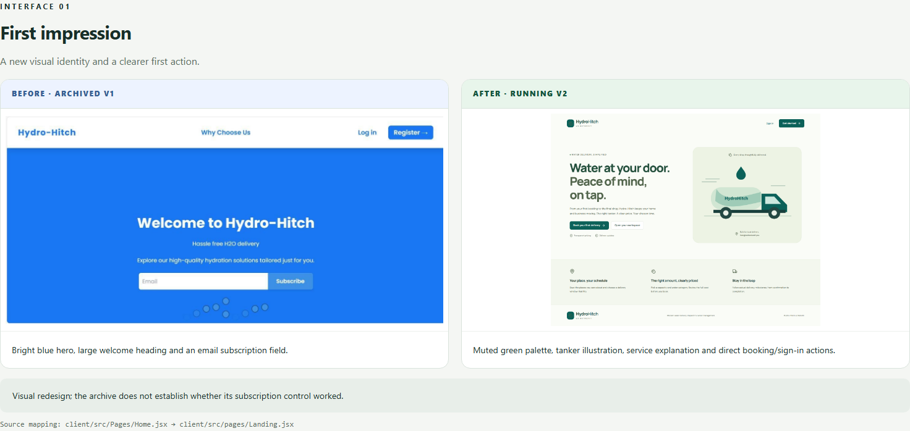
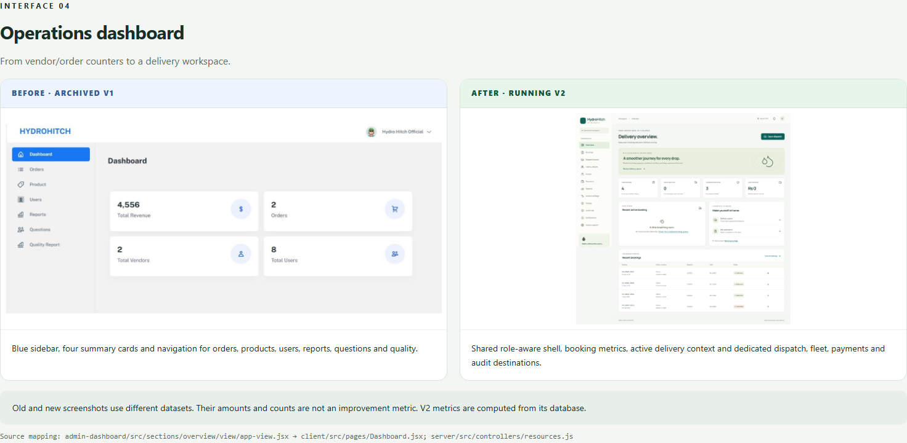

# Before and after: Hydro-Hitch

[Download the interactive comparison](https://github.com/rehmatwadii/Hydro-Hitch/raw/refs/heads/main/docs/comparison/index.html) and open it in your browser. The self-contained HTML works offline and includes image zoom, seven interface comparisons (six paired screenshots) and fourteen technical comparisons. GitHub does not render this HTML as a live page.

Old images come from the original project report. New images are captures from an isolated v2 demo. Datasets differ. The archived checkout image is withheld because it contains a personal account name; its code and behavior changes are still described.

## Homepage

## Operations dashboard

[Detailed changes](CHANGES.md) ? [File-by-file inventory](CHANGED-FILES.txt)

Vendor self-service and the original per-kilometre pricing model have not been carried over. The comparison explicitly documents these gaps.
